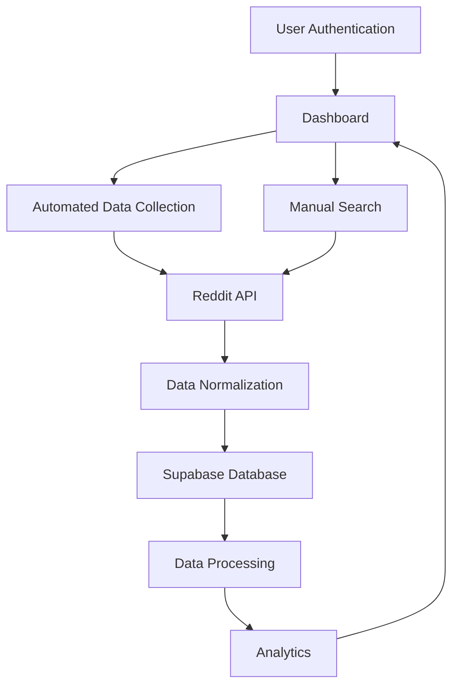

# Product Overview
The Reddit Data Retrieval Tool is a TypeScript-based application deployed on Vercel that collects data from Reddit, stores it in a Supabase database, and provides analytics capabilities. The tool uses Reddit's OAuth for data collection and implements user authentication for accessing the analyzed data.

## Process Flow Diagram


## User Authentication
- Implement user authentication using Supabase Auth
- Users must log in to access the application and view analyzed data
- Use JWT tokens for session management

## Data Collection
### Reddit API Integration
- Utilize Reddit's OAuth for API access ([Reddit OAuth Documentation](https://github.com/reddit-archive/reddit/wiki/OAuth2))
- Implement automatic rate limit handling to comply with Reddit's 100 queries per minute (QPM) limit
- Include NSFW content filtering as per Reddit's API requirements

### Data Sources
- Collect data from Hot ([Reddit Hot API](https://www.reddit.com/dev/api/#GET_hot)), Top ([Reddit Sort API](https://www.reddit.com/dev/api/#GET_{sort})), and Rising ([Reddit Rising API](https://www.reddit.com/dev/api/#GET_rising)) endpoints
- Implement a configurable search feature for subreddits and posts ([Reddit Search API](https://www.reddit.com/dev/api/#GET_search))

### Cron Job
- Set up a single cron job on Vercel to run data collection for all endpoints (Hot, Top, Rising,sort)
- Implement error handling and logging for cron job execution

## Data Storage
### Database
- Use Supabase (PostgreSQL) for data storage
- Normalize data before storing to ensure consistency and reduce redundancy
- Implement data archiving strategy to manage free tier storage limits

### Schema
Create the following tables in Supabase:

1. **Users**
2. **Subreddits**
3. **Posts**
4. **Comments**
5. **AnalyticsResults**

## Data Processing
- Implement batch processing for collected data
- Perform trend detection and sentiment analysis on stored data

## User Interface
Develop a dashboard using ShadcnUI components with the following features:

1. **Data Visualization**: Display Reddit trends and sentiment analysis
2. **Cron Job History**: Log and display cron job execution history
3. **Manual Data Retrieval**: Allow users to manually trigger data collection
4. **User Authentication**: Manage user sessions and access controls
5. **Manual Search Interface**: Allow users to configure search parameters and view results

### Manual Search Feature
- Create a dedicated UI component for manual searches
- Allow users to configure all possible search parameters as defined in the Reddit API documentation ([Reddit Search API](https://www.reddit.com/dev/api/#GET_search))
- Display returned data in a structured format, including post URLs
- Implement pagination for search results

## Security
- Store Reddit API tokens securely using Vercel's environment variables
- Implement proper access controls for Supabase data access

## API Compliance
Implement user-agent validation as per Reddit's API rules:

```typescript
const userAgent = 'RedditDataRetriever/1.0 (by /u/YourRedditUsername)';

const headers = {
  'User-Agent': userAgent
};
```

## Technical Stack
- **Frontend**: Next.js with TypeScript
- **UI Components**: ShadcnUI
- **Backend**: Vercel Serverless Functions
- **Database**: Supabase (PostgreSQL)
- **Authentication**: Supabase Auth
- **Deployment**: Vercel

## Development Workflow
1. **Setup Project**: Initialize the Next.js project with TypeScript and ShadcnUI
2. **Implement Authentication**: Set up user authentication using Supabase Auth
3. **Reddit API Integration**: Develop Reddit API integration with rate limiting and content filtering
4. **Database Schema**: Create Supabase database schema and implement data normalization
5. **Cron Job Setup**: Set up Vercel cron job for regular data collection
6. **Data Processing**: Implement data processing for trend detection and sentiment analysis
7. **Dashboard Development**: Develop the dashboard UI for data visualization and management
8. **Manual Search Feature**: Create the manual search interface with configurable parameters
9. **Error Handling**: Implement proper error handling and logging throughout the application
10. **Testing and Deployment**: Conduct thorough testing and deploy the application to Vercel

## API Integration Details
### Authentication Flow
1. Register the application on Reddit's App Preferences page
2. Obtain client ID and client secret
3. Implement OAuth 2.0 flow for secure API access

### Rate Limiting
- Implement a rate limiter to ensure compliance with Reddit's 100 QPM limit
- Use a token bucket algorithm for efficient rate limiting

### Error Handling
- Implement robust error handling for API requests
- Log and monitor API errors for quick troubleshooting

## Data Normalization Process
1. Parse raw JSON responses from Reddit API
2. Extract relevant fields based on predefined schema
3. Transform data to match Supabase table structures
4. Handle data type conversions and null values

## Analytics Implementation
1. **Trend Detection**: Implement algorithms for time series analysis and topic modeling
2. **Sentiment Analysis**: Integrate sentiment analysis library (e.g., NLTK or TextBlob)
3. **Store Analytics Results**: Store analytics results in dedicated Supabase table

By following this PRD, you'll create a robust Reddit data retrieval tool that complies with API rules, provides valuable insights, and offers a secure, user-friendly interface for data analysis and manual searches.

# Technical Addendum

## System Specifications

### Error Handling & Logging
#### Severity Classification
```typescript
enum ErrorSeverity {
  CRITICAL = 'CRITICAL', // System-wide failures
  ERROR = 'ERROR',       // Operation failures
  WARNING = 'WARNING',   // Performance issues
  INFO = 'INFO'         // Routine operations
}
```

#### Error Log Structure
```typescript
interface ErrorLog {
  id: string;
  timestamp: Date;
  severity: ErrorSeverity;
  source: string;        // Component/function name
  message: string;
  stackTrace?: string;   // Required for ERROR and CRITICAL
  userId?: string;       // If applicable
  requestContext?: {     // For user operations
    endpoint: string;
    method: string;
    parameters: Record<string, unknown>;
  };
}
```

#### Log Management
- Retention period: 7 days
- Automatic cleanup via scheduled task
- Stored in dedicated `error_logs` table in Supabase

### Performance Monitoring

#### Database Metrics
```typescript
interface DatabaseMetrics {
  queryId: string;
  executionTime: number;  // milliseconds
  rowCount: number;
  timestamp: Date;
  queryType: 'SELECT' | 'INSERT' | 'UPDATE' | 'DELETE';
  storageUsage: {
    currentBytes: number;
    percentageUsed: number;
  };
}
```

#### Search Performance Metrics
```typescript
interface SearchMetrics {
  requestId: string;
  duration: number;      // milliseconds
  resultCount: number;
  cacheStatus: 'HIT' | 'MISS';
  apiResponseTime: number;
  userId: string;
  timestamp: Date;
}
```

### Storage Management

#### Data Cleanup Protocol
```typescript
const STORAGE_THRESHOLDS = {
  WARNING: 400_000_000,  // 400MB (80%)
  CRITICAL: 450_000_000, // 450MB (90%)
  MAXIMUM: 500_000_000   // 500MB (100%)
} as const;
```

- Warning notification to admins at 80% usage
- Automated cleanup trigger at 90% usage:
  1. Calculate required space reduction
  2. Delete oldest data first
  3. Preserve minimum 7 days of recent data
  4. Maintain user accounts and settings
  5. Log cleanup operation details

### Rate Limiting

#### Search Limit Configuration
```typescript
interface SearchLimitConfig {
  maxSearches: 60;
  windowHours: 24;
  carryover: false;
}

interface UserSearchMetrics {
  userId: string;
  searches: Array<{
    timestamp: Date;
    query: string;
  }>;
  remainingSearches: number;
}
```

### Administrative Controls

#### Data Management
```typescript
interface DataManagementActions {
  deleteData: {
    selective: boolean;
    dateRange?: DateRange;
    dataTypes: Array<'posts' | 'comments' | 'analytics'>;
    requireConfirmation: true;
  };
  viewStorageMetrics: {
    current: number;
    trend: number[];
    projectedFull: Date;
  };
}
```

#### User Management
```typescript
interface AdminUserControls {
  createUser: (userData: NewUserData) => Promise<User>;
  disableUser: (userId: string) => Promise<void>;
  resetPassword: (userId: string) => Promise<void>;
  adjustSearchLimit: (userId: string, newLimit: number) => Promise<void>;
  viewUserActivity: (userId: string) => Promise<UserActivity[]>;
}
```

#### System Management
```typescript
interface SystemManagement {
  viewMetrics: {
    performance: PerformanceMetrics;
    storage: StorageMetrics;
    userActivity: ActivityMetrics;
  };
  errorLogs: {
    filter: ErrorLogFilter;
    export: boolean;
  };
  manualActions: {
    triggerCleanup: () => Promise<void>;
    resetMetrics: () => Promise<void>;
  };
}
```

### Implementation Notes
1. All metrics and logs stored in dedicated Supabase tables
2. Automated cleanup processes run during low-usage periods
3. Admin actions require secondary confirmation for destructive operations
4. Rate limiting implemented at the API route level
5. All system actions logged for audit purposes

This technical addendum provides implementation-specific details for the core functionality outlined in the main PRD. All implementations should follow the TypeScript interfaces and configurations specified above.

---
Answer from Perplexity: pplx.ai/share